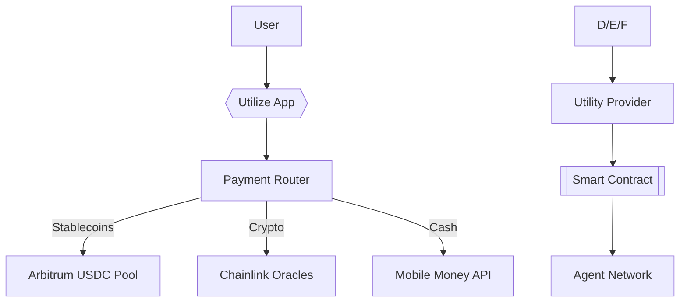

# System Architecture

## **Tech Stack**

**Frontend**: Flutter + WalletConnect (Airtel/MTN SDKs).

**Blockchain**: Arbitrum Stylus (Rust smart contracts).

**Oracles**: Chainlink (CPI data, FX rates).

**Storage**: IPFS (receipt NFTs).

## **Security**

$1M bug bounty via Immunefi.

Non-custodial design (user holds keys).

Quarterly audits by Halborn.
